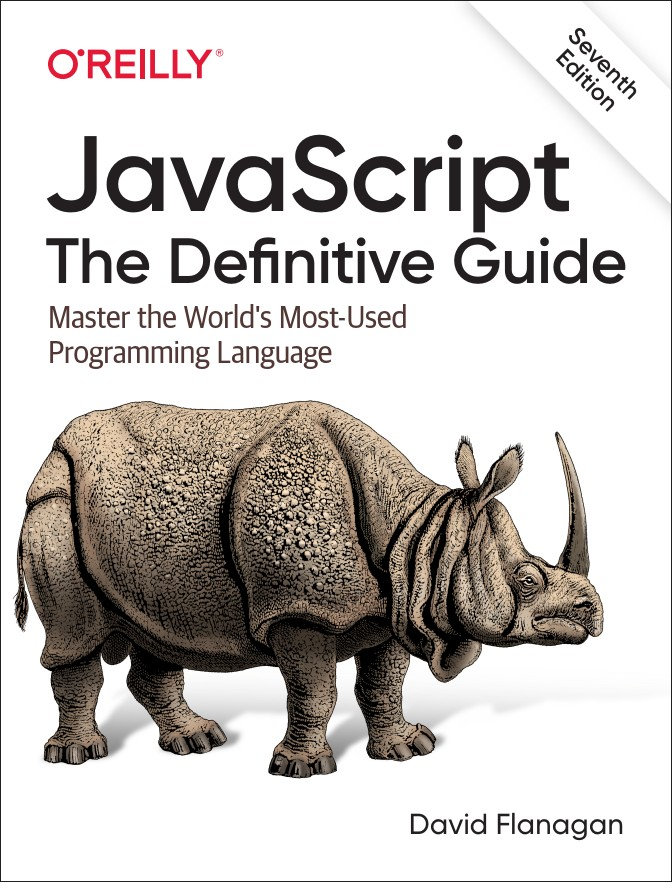
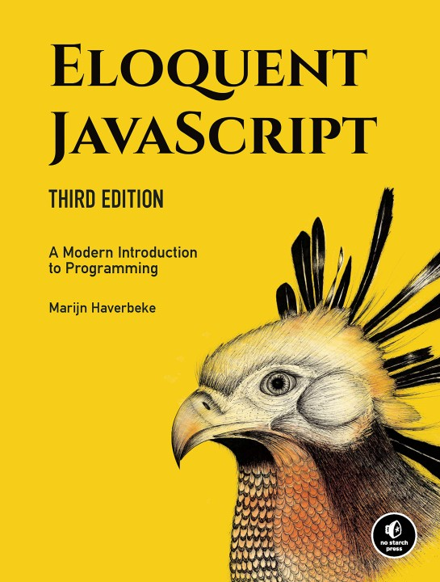

# Desenvolvimento Web (Front-End)

Prof. Eduardo Ono

Versão HTML: https://eduardo-ono.github.io/Desenvolvimento-Web/

 

## Descrição

Introdução ao Desenvolvimento Web Front-End, com ênfase no HTML5, CSS3 e JavaScript (ECMAScript 6).

 

## Conteúdo Programático

| Aula | Data  | Conteúdo |
| ---  | ---   | ---      |
| [01] | 16/02 | Overview de Desenvolvimento Web: Front-End, Back-End e Full-Stack; Instalação e Configuração do Git; Criação e configuração de conta no GitHub; Configuração do GitHub Pages.
| [02] | 23/02 | Instalação e configuração do VS Code; Revisão de Redes e Internet; Introdução à linguagem HTML.
| [03] | 09/03 | Introdução a CSS: Principais seletores e atributos, cores e fontes.
| [04] | 16/03 | CSS (cont.); Position; Layouts: flexbox, grid layout
| [05] | 23/03 | Fundamentos da linguagem JavaScript.
| [06] | 30/03 | APIs, JSON, AJAX.
| [07] | 06/04 | Programação Funcional e Orientada à Objetos em JavaScript.
| [08] | 13/03 | [__1a. AVALIAÇÃO__](./avaliacoes/README.md); Desenvolvimento Back-End; Introdução à linguagem PHP.

[01]: ./aulas/README.md#aula-01
[02]: ./aulas/README.md#aula-02
[03]: ./aulas/README.md#aula-03
[04]: ./aulas/README.md#aula-04
[05]: ./aulas/README.md#aula-05
[06]: ./aulas/README.md#aula-06
[07]: ./aulas/README.md#aula-07
[08]: ./aulas/README.md#aula-08

 

## Recursos

* ### Sites

  * https://www.w3schools.com

  * https://fonts.google.com

  * https://regex101.com/

  * https://www.mathjax.org

* ### Softwares

  * Microsoft Visual Studio Code - https://code.visualstudio.com

    * https://code.visualstudio.com/shortcuts/keyboard-shortcuts-windows.pdf
    * https://docs.emmet.io/cheat-sheet/

  * BlueGriffon - http://bluegriffon.org

 

## Bibliografia Básica

| Capa | Descrição |
| ---  | --- |
|  | [ROBBINS-5e_2018] ROBBINS, Jennifer N. __Learning Web Design: A Beginner's Guide to HTML, CSS, JavaScript, and Web Graphics__. 5. ed., 2018[.](https://app.box.com/s/thfya26nnxo8gwbwo09qjfwq83n96m4a)
|  | [FLANAGAN-6e_2013] FLANAGAN, David. [__JavaScript: O Guia Definitivo__](https://www.academia.edu/40442620/JavaScript_O_Guia_Definitivo_v). 6. ed. Porto Alegre: Bookman, 2013[.](https://app.box.com/s/1nud9latis2zqn63f3ycsj0nv7zlv1mr)
|  | [FLANAGAN-7e_2020] FLANAGAN, David. __JavaScript: The Definitive Guide__. 7. ed. O’Reilly Media, 2020.

 

## Bibliografia Complementar

| Capa | Descrição |
| ---  | ---       |
|  | [CHACON_2014] CHACON, Scott; STRAUB, Ben. [__Pro Git__](https://git-scm.com/book/). 2. ed. Apress, 2014.
|  | [Git Notes for Professionals](https://goalkicker.com/GitBook/)
|  | [HAVERBEKE-3e_2018] HAVERBEKE, Marijn. [__Eloquent JavaScript__](https://archive.org/details/2018eloquentjavascript). 3. ed., 2018.
|  | [GRONER-2e_2018] GRONER, Loiane. __Estruturas de Dados e Algoritmos em JavaScript__. São Paulo: Novatec, 2018[.](https://app.box.com/s/ad9284w4gaxfyi3s6jtngy9i2wjnnx2k)
|  | [BUNA_2016] BUNA, Samer. [__React.js Succinctly__](https://www.syncfusion.com/ebooks/reactjs_succinctly), 2016.

 

## Vídeos Recomendados

| Thumb | Título |
| --- | --- |
|  | [Yuval Noah Harari] [Uma conversa entre Mark Zuckerberg & Yuval Noah Harari](https://www.youtube.com/watch?v=Boj9eD0Wug8) (1:33:30, YouTube)

 

## Filmes e Documentários Recomendados

| Thumb | Título |
| --- | --- |
 | [PC Tweaks] [History of the Internet 2018 Documentary](https://www.youtube.com/watch?v=ILQeXZTOpkw) (54:02)
 | [The Documentary Network] [Project Code Rush - The Beginnings of Netscape / Mozilla Documentary](https://www.youtube.com/watch?v=4Q7FTjhvZ7Y) (56:08)
 | [DW Documentary] [Internet from outer space / DW Documentary](https://www.youtube.com/watch?v=IsqSwMsI_mc) (42:25, YouTube, Out/2020)

 
