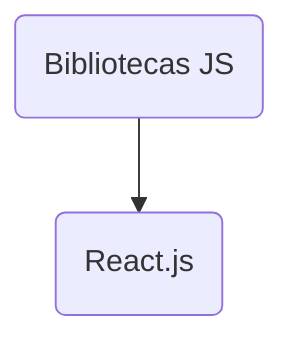

<h1 align="center">Desenvolvimento Web Front-end</h1>
<h3 align="center">Prof. Eduardo Ono</h3>
<h6 align="center"></h6>

&nbsp;

## Descrição

Introdução ao Desenvolvimento Web Front-end com ênfase em HTML5, CSS3, JavaScript (ES6) e TypeScript, além de frameworks e bibliotecas como o React.js.

&nbsp;

## Sumário

* [__Conteúdo__](./conteudo/)
* [__Imersões__](./imersoes/)
* [__Projetos__](./projetos/)

&nbsp;

## Conteúdo Programático

| Aula | Data  | Descrição |
| :-:  | :-:   | ---      |
| [01] |  | - Overview de Desenvolvimento Web: Front-end, Back-end e Full-Stack. |
| [02] |  | - Configuração do ambiente de desenvolvimento;  - Revisão de Redes e Internet. |
| [03] |  | - Instalação e configuração do Git;  - Cadastro e configuração de uma conta no GitHub;  - Configuração do GitHub Pages. |
| [04] |  | - Introdução à linguagem HTML. |
| [05] |  | - Introdução ao CSS; Principais seletores e atributos; Cores e fontes. |
| [06] |  | - CSS: Position; Layouts: flexbox, grid layout;  - Exemplo: [Formulário de login].  |
| [07] |  | - Fundamentos da linguagem JavaScript. |
| [08] |  | - DOM; [Projeto "To Do List"]. |
| [09] |  | - Consumo de APIs, JSON, AJAX. |
| [10] |  | - Orientação à Objetos em JavaScript; Introdução ao desenvolvimento Back-End. |
| [11] |  | - Fundamentos da linguagem TypeScript. |
| [12] |  | - Introdução à biblioteca React.js. |
| [13] |  | - Exemplo de aplicação front-end com React.js. |

[01]: ./conteudo/00-overview/
[02]: ./conteudo/01-ambiente-de-desenvolvimento/
[03]: ./conteudo/01-ambiente-de-desenvolvimento/git-github/
[04]: ./conteudo/03-html/
[05]: ./conteudo/04-css/
[06]: ./conteudo/04-css/layouts/
[07]: ./conteudo/05-javascript/
[08]: ./projetos/todo-list/
[09]: ./conteudo/05-javascript/js-fetch-api/
[10]: ./conteudo/05-javascript/js-poo/
[11]: ./conteudo/06-typescript/
[12]: ./conteudo/react-js/
[13]: ./imersoes/nlw-expert-14/react/
[Formulário de login]: ./conteudo/04-css/exemplos/README.md
[Projeto "To Do List"]: ./projetos/todo-list/README.md

&nbsp;

## Árvore de Conteúdo

&nbsp;

## Recursos

* ### Sites da Internet

  * <https://www.w3schools.com>
  * <https://fonts.google.com>
  * <https://regex101.com>
  * <https://colorhunt.co>
  * <https://www.mathjax.org>

* ### Canais do YouTube

  * [Rocketseat](https://www.youtube.com/@rocketseat)

* ### Softwares

  * Microsoft Visual Studio Code (VS Code)

    * <https://code.visualstudio.com>
    * <https://code.visualstudio.com/shortcuts/keyboard-shortcuts-windows.pdf>
    * <https://docs.emmet.io/cheat-sheet/>

  * BlueGriffon - <http://bluegriffon.org>

&nbsp;

## Bibliografia Básica

| Capa | Descrição |
| ---  | --- |
|  | [ROBBINS-5e_2018] ROBBINS, Jennifer N. __Learning Web Design: A Beginner's Guide to HTML, CSS, JavaScript, and Web Graphics__. 5. ed., 2018[.](https://app.box.com/s/thfya26nnxo8gwbwo09qjfwq83n96m4a) |
|  | [FLANAGAN-6e_2013] FLANAGAN, David. [__JavaScript: O Guia Definitivo__](https://www.academia.edu/40442620/JavaScript_O_Guia_Definitivo_v). 6. ed. Porto Alegre: Bookman, 2013[.](https://app.box.com/s/1nud9latis2zqn63f3ycsj0nv7zlv1mr) |
|  | [FLANAGAN-7e_2020] FLANAGAN, David. __JavaScript: The Definitive Guide__. 7. ed. O’Reilly Media, 2020. |

&nbsp;

## Bibliografia Complementar

| Capa | Descrição |
| ---  | ---       |
|  | [CHACON_2014] CHACON, Scott; STRAUB, Ben. [__Pro Git__](https://git-scm.com/book/). 2. ed. Apress, 2014. |
|  | [Git Notes for Professionals](https://goalkicker.com/GitBook/) |
|  | [HAVERBEKE-3e_2018] HAVERBEKE, Marijn. [__Eloquent JavaScript__](https://archive.org/details/2018eloquentjavascript). 3. ed., 2018. |
|  | [GRONER-2e_2018] GRONER, Loiane. __Estruturas de Dados e Algoritmos em JavaScript__. São Paulo: Novatec, 2018[.](https://app.box.com/s/ad9284w4gaxfyi3s6jtngy9i2wjnnx2k) |
|  | [BUNA_2016] BUNA, Samer. [__React.js Succinctly__](https://www.syncfusion.com/ebooks/reactjs_succinctly), 2016. |

&nbsp;

## Vídeos Recomendados

| Thumb | Descrição |
| --- | --- |
|  | [Fabio Akita] [__A História do Front-End para Iniciantes em Programação \| Série "Começando aos 40"__](https://www.youtube.com/watch?v=VKmPGmFY7H4) (48:27, YouTube, 13/Fev/2019) |
|  | [Fabio Akita] [__"Akita, quais Cursos você recomenda? E o Low-Code? E o GPT-3?"__](https://www.youtube.com/watch?v=1RARFXh_aa0) (41:29, YouTube, Ago/2020) |
|  | [Yuval Noah Harari] [__Uma conversa entre Mark Zuckerberg & Yuval Noah Harari__](https://www.youtube.com/watch?v=Boj9eD0Wug8) (1:33:30, YouTube, Abr/2019) |

&nbsp;

## Filmes e Documentários Recomendados

| Thumb | Descrição |
| --- | --- |
|  | [PC Tweaks] [__History of the Internet 2018 Documentary__](https://www.youtube.com/watch?v=ILQeXZTOpkw) (54:02, Youtube, Out/2018) |
|  | [The Documentary Network] [__Project Code Rush - The Beginnings of Netscape / Mozilla Documentary__](https://www.youtube.com/watch?v=4Q7FTjhvZ7Y) (56:08, YouTube, Ago/2013) |
|  | [DW Documentary] [__Internet from outer space / DW Documentary__](https://www.youtube.com/watch?v=IsqSwMsI_mc) (42:25, YouTube, Out/2020) |

&nbsp;
