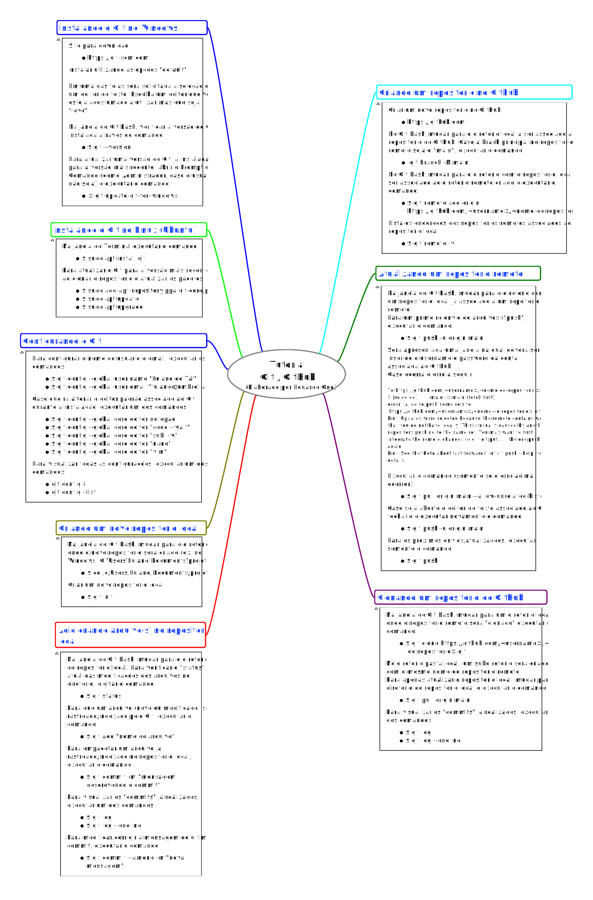

> ### Desenvolvimento Web > Conteúdo

# Ambientes de Desenvolvimento

Prof. Eduardo Ono

 

## Ferramentas de Desenvolvimento

### Git/GitHub

Comandos Básicos do Git/GitHub

#### Vídeos Recomendados

* [Filipe Deschamps] [680 Recursos Grátis para Programadores Frontend, Backend, DevOps e Designers](https://www.youtube.com/watch?v=tpaSZ8x21PI) (YouTube, 10:00)

 

### asdf (Linux)

* https://asdf-vm.com/#/core-manage-asdf

No Terminal (Bash), digitar:

    git clone https://github.com/asdf-vm/asdf.git ~/.asdf --branch v0.8.0

Abrir o arquivo `~/.bashrc` e adicionar as linhas (inclusive os pontos iniciais):

    . $HOME/.asdf/asdf.sh
    . $HOME/.asdf/completions/asdf.bash

 

## Editores/IDEs (Geral)

### Microsoft Visual Studio Code (VS Code)

#### Instalação (Windows)

Site do desenvolvedor:

* https://code.visualstudio.com

Vídeos:

* [freeCodeCamp.org] [Visual Studio Code Crash Course](https://www.youtube.com/watch?v=WPqXP_kLzpo) (YouTube, 1:32:34)

#### Instalação (Ubuntu)

No Terminal, digitar:

    $ sudo snap install code --classic

#### Extensões:

* [Código Fonte TV] [23 Extensões do VS Code para 2020](https://www.youtube.com/watch?v=tmgpF7Bn3_E) (YouTube, 15:44)

 

## Editores HTML

### BlueGriffon

* http://bluegriffon.org/

 

## Node.js e (pacote) live-server

> O ***Node.js*** é um ambiente de execução para JavaScript, sendo necessário para a instalação e execução de outros softwares. 

> O ***live-server*** é um pequeno servidor para desenvolvimento web (HTML/CSS/JS) com capacidade para "live reload" ("hot reload"). Não deve ser utilizado em ambientes de produção.

### Instalação do Node.js (Windows)

* [Bóson Treinamentos] [Como baixar e instalar o Node.js no Windows 10](https://youtu.be/Wras1X6rBrc) (YouTube, 10:22)

### Instalação do live-server (Windows)

> Obs.: Requer o Node.js já instalado.

    > npm install -g live-server

### Instalação do Node.js (Ubuntu)

    $ sudo apt install nodejs

### Instalação do live-server (Ubuntu)

> Obs.: Requer o Node.js já instalado.

    $ npm install -g live-server

### Executando o live-server

Para executar o live-server, mudar para o diretório do projeto e digitar:

    live-server

 

## Sistemas Operacionais

### Linux (Ubuntu)

* [Fabio Akita] [O Guia DEFINITIVO de UBUNTU para Devs Iniciantes](https://youtu.be/epiyExCyb2s) (YouTube, 1:20:18)

### Microsoft Windows

*

 

### Vídeos Recomendados

* [LINUXtips] [Giovanni Bassi - Usando um ambiente Linux completo no Windows com WSL e VSCode (Abr/2020)](https://www.youtube.com/watch?v=_Uqf5_kN6Rw) (YouTube, 2:10:00)

 

## Bibliografia

* BOOTH, Joseph D. [GitHub Succinctly](https://www.syncfusion.com/ebooks/github_succinctly), 80p, 2016.

 
