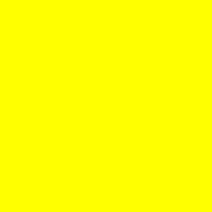

<table>
<tr>
<td align="left" width="8000">
  <small>Desenvolvimento Web (Front-End)</small>
</td>
<td align="right">
  <small>Atualizado&nbsp;em:&nbsp;28/04/2022</small>
</td>
</tr>
</table>

 

<h1 align="center">
Cores
</h1>
<h4 align="center">
Prof. Eduardo Ono
</h4>

 

## Padrão RGB

&nbsp;&nbsp;&nbsp;&nbsp;O RGBA (8-bit) é um sistema de cores bastante utilizado na criação de páginas web. Nesse padrão, uma cor é constituida por três componentes: R (red), G (green), B (blue) mais o canal alpha A, que corresponde à fração percentaul de opacidade. Cada componente de cor é representado por um valor de 8-bit, ou seja, em valor inteiro de 0 a 255.

&nbsp;&nbsp;&nbsp;&nbsp;Exemplos:

| Cor | RGB | Hex | Preview |
| --- | :--: | :-: | :-: |
| Branco | 255, 255, 255 | FFFFFF | 
| Preto | 0, 0, 0 | 000000 | 
| Cinza médio | 128, 128, 128 | 808080 |  
| Vermelho (puro) | 255, 0, 0 | FF0000 | 
| Verde (puro) | 0, 255, 0 | 00FF00 | 
| Azul (puro) | 0, 0, 255 | 0000FF |  
| Amarelo | 255, 255, 0, 1 | FFFF00 | 
| Ciano | 0, 255, 255 | 00FFFF | 
| Magenta (Magenta ou Fuchsia) | 255, 255, 0 | FF00FF | 
| Púrpura (Purple) | 128, 0, 128 | 800080 | 

 

## Padrão RGBA

&nbsp;&nbsp;&nbsp;&nbsp;O RGBA (8-bit) é um sistema de cores bastante utilizado na criação de páginas web. Nesse padrão, uma cor é constituida por três componentes: R (red), G (green), B (blue) mais o canal alpha A, que corresponde à fração percentaul de opacidade. Cada componente de cor é representado por um valor de 8-bit, ou seja, em valor inteiro de 0 a 255.

&nbsp;&nbsp;&nbsp;&nbsp;Exemplos:

| Cor | RGB | Hex | Preview |
| --- | :--: | :-: | :-: |
| Branco (50%) | 255, 255, 255, 0.5 | FFFFFF80 | 
| Vermelho (50%) | 255, 0, 0, 0.5 | FF000080 | 
