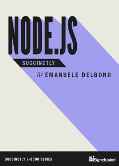

> Desenvolvimento Web (Front-End) > Conteúdo

# JavaScript

Prof. Eduardo Ono

Versão HTML: https://eduardo-ono.github.io/Desenvolvimento-Web/conteudo/05-javascript/

 

## Mapa Mental

  

 

## Sumário

* ### [Overview](./00-overview/README.md)

* ### [Ambiente de Desenvolvimento](./01-ambiente-de-desenvolvimento/README.md)

* ### [Fundamentos da Linguagem JavaScript](./js-fundamentos/)

* ### [Programação Orientada a Objetos em JavaScript](./js-poo/)

* ### Programação Funcional em JavaScript

  * Arrow Functions

* ### [Estrutura de Dados](./js-estrutura-de-dados/)

* ### [Bibliotecas](./js-bibliotecas)

  * Fancybox

* ### Frameworks

 

## Canais do YouTube Recomendados

* [queroser.ninja - Fernando Daciuk](https://www.youtube.com/channel/UCoMS25HuclMfa6IQJNcvh2w)

* [James Q Quick](https://www.youtube.com/c/JamesQQuick)

 

## Frameworks

| Thumb | Descrição |
| :-: | --- |
|  | [Fireship] [__I built the same app 10 times // Which JS Framework is best?__](https://www.youtube.com/watch?v=cuHDQhDhvPE)   (21:58, YouTube, Ago/2021)

 

## Bibliografia Básica

| Thumb | Descrição |
| :-: | --- |
|  | [FLANAGAN-6e_2013] FLANAGAN, David. [__JavaScript: O Guia Definitivo__](https://www.academia.edu/40442620/JavaScript_O_Guia_Definitivo_v). 6. ed. Porto Alegre: Bookman, 2013[.](https://app.box.com/s/1nud9latis2zqn63f3ycsj0nv7zlv1mr)
|  | [FLANAGAN-7e_2020] FLANAGAN, David. __JavaScript: The Definitive Guide__. 7. ed. O’Reilly Media, 2020.
|  | [DELBONO_2016] DelBONO, Emanuele. [__Node.js Succinctly__](https://www.syncfusion.com/succinctly-free-ebooks/nodejs). 1 ed. Morrisville: Syncfusion, 2016.

## Bibliografia Complementar

* [JavaScript Notes for Professionals](https://goalkicker.com/HTML5Book/) (PDF)

 
