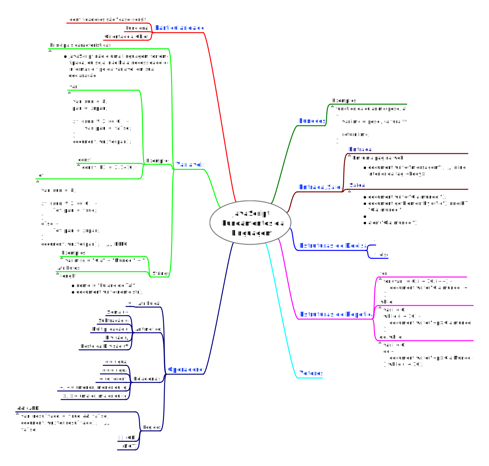

## JavaScript

Prof. Eduardo Ono

 

### Overview
 

 

### Fundamentos da Linguagem
 

* [Derek Banas] [JavaScript Tutorial](https://youtu.be/fju9ii8YsGs) (YouTube, 1:37:08)
* [Traversy Media] [JavaScript Crash Course for Beginners](https://youtu.be/hdI2bqOjy3c) (YouTube, 1:40:29)
* [Derek Banas] [ECMAScript 6 Tutorial](https://youtu.be/Jakoi0G8lBg) (YouTube, 45:30)
* [Academind] [JavaScript Data Structures: Getting Started](https://youtu.be/41GSinwoMYA) (YouTube, 1:36:46)

 

### JavaScript Orientado a Objetos
 

* [Derek Banas] [Object Oriented JavaScript](https://youtu.be/O8wwnhdkPE4) (YouTube, 1:00:34)
* [Traversy Media] [JavaScript OOP Crash Course (ES5 & ES6)](https://youtu.be/vDJpGenyHaA) (YouTube, 40:20)
* [Programming with Mosh] [ES6 Tutorial: Learn Modern JavaScript in 1 Hour](https://www.youtube.com/watch?v=NCwa_xi0Uuc) (YouTube, 50:04)

 

### Bibliografia
 

* [JavaScript Notes for Professionals](https://goalkicker.com/HTML5Book/) (PDF)
